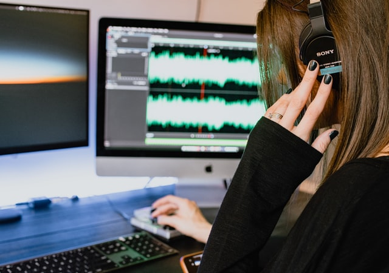
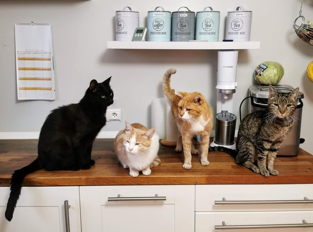

<!--    -->
  

# **PREM KUMAR.K**
*Data Scientist | Experience: 4+ yrs*  

#### **REACH ME:**
**`Email:`** premkumarkaliyamoorthy@gmail.com  
**`Contact:`** 8838787234  
**`LinkedIn:`** [https://www.linkedin.com/in/prem-kumar-870820133](https://www.linkedin.com/in/prem-kumar-870820133)

### **PROFESSIONAL EXPERIENCE:**
1. `Quantiphi Analytics Pvt Ltd` , *Mar,2021 - Present*
2. `Kryptos Technologies Pvt Ltd` , *Nov,2019 - Nov,2020*
3. `Tata Consultancy Services` , *Jan,2017 - Mar, 2019*

### **EDUCATION:**
* B.Tech in Mechanical Engineering, *Pondicherry University*, 2012-16, CGPA: *9.01/10*

### **SKILLS:**
1. `Languages       :` Python.
2. `Frameworks      :` Flask, Scikit-Learn, Keras, Tensorflow, river.
3. `Tools           :` Git, SQL, Sagemaker, Docker, Airflow, MongoDB, DVC, Mlflow, ElasticSearch.
4. `Cloud           :` AWS & its services.
5. `Technologies    :` Machine Learning, Deep Learning, Computer Vision, NLP.
6. `Major Libraries :` Numpy, Pandas, Matplotlib, Seaborn, cv2, NLTK, Librosa, BeautifulSoup.

### **PROJECT 1: CHORUS DETECTION**  
---
> **This project is a music retrieval system which is detecting the instances of chorus section in the music recording. Generally, chorus section in the audio represents the most repetitive part in the song.**

  
Photo by <a href="https://unsplash.com/@kellysikkema?utm_source=unsplash&utm_medium=referral&utm_content=creditCopyText">Kelly Sikkema</a> on <a href="https://unsplash.com/s/photos/audio?utm_source=unsplash&utm_medium=referral&utm_content=creditCopyText">Unsplash</a>

**`Tools      :`** AWS EC2, Python, Docker, Flask.    
**`Technology :`** Machine Learning, Audio Processing, Image Processing.  
**`Algorithm  :`** DBSCAN.  

##### **RESPONSIBILITIES:**
* Given an audio, convert the audio into time-time similarity matrix and time-lag similarity matrix using chorma features.
* Smoothing and binarize the similarity matrix using image processing techniques
* Finding the clusters in the processed image which represents the similar parts in the audio.
* Finding the matching chorus and trim the found choruses from the audio and split the audio into vocal component and Accompaniment component.
* Finding the presence of voice using Spectral Energy.
* Packaged the model into docker container and it is published in the AWS MarketPlace.

### **PROJECT 2: SIMILAR IMAGES RETRIEVAL** 
---
> **This project is a similar image retrieval system which is, given a query image retrieving the similar images in the database of images.**

  
Photo by <a href="https://unsplash.com/@d13n?utm_source=unsplash&utm_medium=referral&utm_content=creditCopyText">Dietmar Ludmann</a> on <a href="https://unsplash.com/s/photos/cats?utm_source=unsplash&utm_medium=referral&utm_content=creditCopyText">Unsplash</a>

**`Tools      :`** AWS EC2, python, Elastic Search, AWS Sagemaker.   
**`Technology :`** Machine Learning, Deep Learning, Image Processing.    
**`Algorithm  :`** K-Nearest Neighbor, ResNet.    

##### **RESPONSIBILITIES:**
* The task here is, given a query image retrieving all the similar images in the database.
* Used ResNet to find the encoding of all the available images in the dataset.
* Uploaded all the image feature encodings in the AWS ElasticSearch with unique id for each image.
* Given a query image, find the encoding using the ResNet model and used elastic search KNN to find the k nearest neighbors.

### **PROJECT 3: BAGS CLASSIFIER**  
---
> **Focused on image classification model which classifies the different type of bags of a single luxury brand inorder to automate the manual process.**

  
Photo by <a href="https://unsplash.com/@dreamcatchlight?utm_source=unsplash&utm_medium=referral&utm_content=creditCopyText">Diana Akhmetianova</a> on <a href="https://unsplash.com/s/photos/bags?utm_source=unsplash&utm_medium=referral&utm_content=creditCopyText">Unsplash</a>

**`Tools      :`** AWS EC2, python, AWS Sagemaker, AWS Rekognition.   
**`Technology :`** Deep Learning, Image Processing.     
**`Algorithm  :`** ResNet.    

##### **RESPONSIBILITIES:**
* The task here is to build a image classification model which classifies the given image
* Implemented different techniques to counter the imbalanced dataset as the data was imbalanced.
* Used the AWS Rekognition to train the model and got the  evaluation metrics and also train another AWS Sagemaker built-in image classification algorithm model and got the metrics for it too.
* Explained to the client about this two models, their corresponding metrics and the cost requirements of using this model and suggest which can be least expensive.
* Deployed the sagemaker model using sagemaker endpoint.

### **PROJECT 4: MLOPS PLATFORM**
---
> **Worked on agile environment to built a MLOps platform where we built and tested an entire ML lifecycle using sagemaker BYOC, pipelines using Airflow for different ML use cases and helped organization to migrate their use cases to our platform.**

  
Photo by <a href="https://unsplash.com/@glenncarstenspeters?utm_source=unsplash&utm_medium=referral&utm_content=creditCopyText">Glenn Carstens-Peters</a> on <a href="https://unsplash.com/s/photos/machine-learning?utm_source=unsplash&utm_medium=referral&utm_content=creditCopyText">Unsplash</a>

**`Tools      :`** Python, Sagemaker Pipelines, Sagemaker Projects, Vertex AI(GCP), Kubeflow, Airflow, Docker.   
**`Technology :`** Machine Learning, Deep Learning.   

##### **Responsibility:**
* Created a components for each ML lifecycle like processing, Training, Explainability and Monitoring using Sagemaker BYOC and Docker
* Created a different pipelines for different tasks like Training, Retraining, Inference, create endpoint and Monitoring using Airflow.
* Built a sample projects with each use cases like tabular, Computer Vision and NLP to test the entire ML lifecycle using the platform we created.
* Documented the user manual for do's and dont's of components, pipelines and their inner working and how to create them on their own for their own use cases.
* Helped organization to migrate their projects into our platform and gave them deep dive sessions for how to migrate them on their own.

### **PROJECT 5: PACING RATE PREDICTION**
---
> **This project focused on predicting the pacing rate which helps to make the number of outbound calls in a call center in a bank in order to optimize the work force in the campaign.**

  
Photo by <a href="https://unsplash.com/@austindistel?utm_source=unsplash&utm_medium=referral&utm_content=creditCopyText">Austin Distel</a> on <a href="https://unsplash.com/s/photos/call-center?utm_source=unsplash&utm_medium=referral&utm_content=creditCopyText">Unsplash</a>

**`Tools      :`** Python, MongoDB.    
**`Technology :`** Machine Learning, Time Series.     

##### **RESPONSIBILITIES:**
* The task here is to predict the pacing rate in order to automate the manual change of pacing rate in the call center application of the bank. 
* Pacing rate determines how many outbound calls to dial for the particular time.
* Did explanatory data analysis and time series analysis to find out the call acceptance pattern and time taken by the caller to accept and other features.
* Built a formula that can predict the pacing rate and created a script that can dynamically predict the pacing rate for the particular time using those features.
* Deployed the script in the production and used cron to scheduled it.

### **PROJECT 6: EMOTION DETECTION MODEL**
---
> **This project focused on image classification model which classifies the different type of emotions of a human while playing the dart game in the entertainment center.**

  
Photo by <a href="https://unsplash.com/@tengyart?utm_source=unsplash&utm_medium=referral&utm_content=creditCopyText">Tengyart</a> on <a href="https://unsplash.com/s/photos/emotion?utm_source=unsplash&utm_medium=referral&utm_content=creditCopyText">Unsplash</a>

**`Tools      :`** AWS EC2, Python, Flask.   
**`Technology :`** Deep Learning, Image Processing.    
**`Algorithm  :`** Xception Network.    

##### **RESPONSIBILITIES:**
* The task here is, predict the emotion of the players playing the dart game in entertainment center.
* Collected the images using the camera used to shoot the players while playing the game
* Used different augmentation techniques to create more data for the training
* Tried different face detection model to find out the best face detection system since the camera is nearly 2 metres away from the user.
* Trained an Xception model to classify human emotions in the particular frame of the video
* Used tflite to reduce the model size to deploy the model in the on-prem devices.
* Built a Flask API to predict emotion in the given image and sent the image for the next process of making the highlights video of the good moments during the play.

### **PROJECT 7: AGE & GENDER DETECTION**
---
> **This project focuses on two image classification models where one model detects the gender and the other detects the age of the user for verification of user during the KYC process in the bank.**  

  
Photo by <a href="https://unsplash.com/@nate_dumlao?utm_source=unsplash&utm_medium=referral&utm_content=creditCopyText">Nathan Dumlao</a> on <a href="https://unsplash.com/s/photos/family?utm_source=unsplash&utm_medium=referral&utm_content=creditCopyText">Unsplash</a>

**`Tools      :`** Python.   
**`Technology :`** Deep Learning, Image Processing.    
**`Algorithm  :`** MobileNet for Face Detection, ResNet for Gender Detection.    

##### **RESPONSIBILITIES:**
* The task here is, predict the gender and age of the user to verify during the KYC process.
* Collected dataset from various resources for both the application and received from client as well.
* Implemented different techniques to counter the imbalanced dataset as the data was imbalanced.
* Used multi-threading techniques to run both the model and deployed the model in the production on-prem devices in the bank.

### **PROJECT 8: STENCIL NUMBER EXTRACTION**
---
> **This project focused on extracting the stencil numbers in the tires of an automobile.**

  
Photo by <a href="https://unsplash.com/@nazimzafri?utm_source=unsplash&utm_medium=referral&utm_content=creditCopyText">Nazim Zafri</a> on <a href="https://unsplash.com/s/photos/tyre?utm_source=unsplash&utm_medium=referral&utm_content=creditCopyText">Unsplash</a>

**`Tools      :`** Python, AWS EC2.    
**`Technology :`** Machine Learning, Image Processing, Deep Learning.     
**`Algorithm  :`** OCR.    

##### **RESPONSIBILITIES:**
* The task here is, extract the stencil number in the given image which contains tyres.
* Tried different image processing techniques like smoothing, binarizing, edge detection, skew correction, dewaring, etc to extract the words out of it.
* Tried to use AWS Textract and AWS rekognition to extract the words out of the image
* Tried OCR techniques like EasyOCR, pytesseract to extract the text out of the images.

### **PROJECT 9: EXTRACT & VERIFY SIGNATURES**
---
> **This project focused on extracting and verifying the signatures of a user in the bank.**

  
Photo by <a href="https://unsplash.com/@signaturepro?utm_source=unsplash&utm_medium=referral&utm_content=creditCopyText">Signature Pro</a> on <a href="https://unsplash.com/s/photos/signature?utm_source=unsplash&utm_medium=referral&utm_content=creditCopyText">Unsplash</a>

**`Tools      :`** Python.   
**`Technology :`** Machine Learning, Deep Learning, Image Processing.    
**`Algorithm  :`** Yolov3, Siamese Network.   

##### **RESPONSIBILITIES:**
* The task here is, extract the signature and verify the signature with the original signature
* Trained Yolov3 to extract the signatures from the given image
* Trained a siamese network model to verify whether both the images are similar or not.

### **PROJECT 10: PREDICTION OF BEST TOOL**
---
> **This project focused on predicting the best tool for the manufacturing process under given operating conditions.**

  
Photo by <a href="https://unsplash.com/@greg_rosenke?utm_source=unsplash&utm_medium=referral&utm_content=creditCopyText">Greg Rosenke</a> on <a href="https://unsplash.com/s/photos/manufacturing?utm_source=unsplash&utm_medium=referral&utm_content=creditCopyText">Unsplash</a>

**`Tools      :`** Python.   
**`Technology :`** Machine Learning, Natural Language Processing.    
**`Algorithm  :`** Logistic Regression.    

##### **RESPONSIBILITIES:**
* The task here is, predict the best tool for the manufacturing process under certain operating conditions.
* Given the text document, extract a features using regex and Natural language processing and save it as csv.
* Tried different machine learning algorithm to figure out which model performs better for our metric.
* Deployed the model into the production on on-prem devices.

### **PROJECT 11: Forecasting of Resource Utilization**
---
> **This project focused on forecasting the resource utilization for the telecom industry.**

**`Tools      :`** Python, AWS Forecasting.   
**`Technology :`** Machine Learning, Time Series Forecasting.    

##### **RESPONSIBILITIES:**
* The task here is, forecast the resource utilization for the given time interval.
* Given the csv files which contain data of utilization of past. 
* Tried different preprocessing techniques using Pandas and saved it a way AWS Forecasting demands it.
* Build different models using AWS Forecasting to build forecasting model and compared the results.

### **PROJECT 12: Migration of a machine learning model from GCP to AWS environment**
---
> **This project focused on migration of a ML model from GCP environment to AWS environment.**

**`Tools      :`** Python, AWS Sagemaker, Docker.   
**`Technology :`** Machine Learning.    

##### **RESPONSIBILITIES:**
* The task here is, to migrate the machine learning model which was deployed on GCP environment to AWS environment.
* Used Sagemaker BYOC concept to migrate the model from GCP to AWS. 
* Sagemaker BYOC expects a docker container which contains the environment for the model to be deployed, so created a dockerfile which does that.
* Once the docker image has been created, the sagemaker endpoint has been created using the docker image and the model from the GCP environment.
